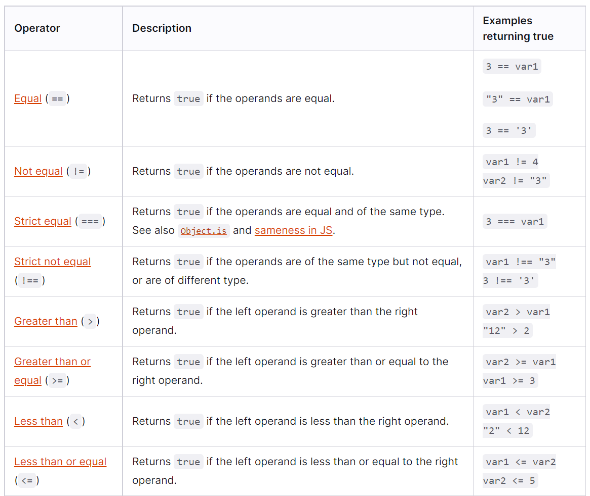
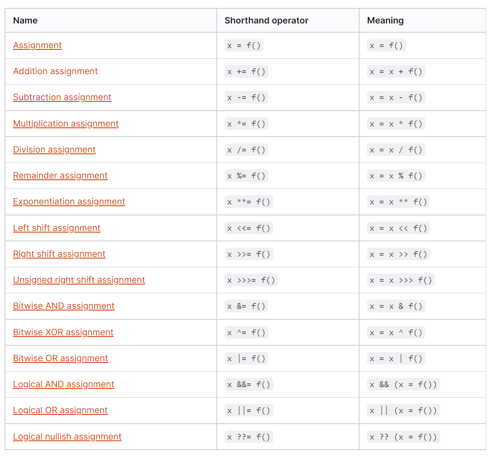
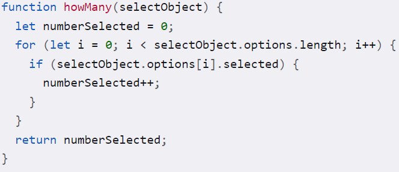
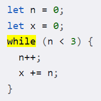

# Operators and Loops

## **Operators**

Operators exist to show the relationship between variables in code. Two examples of kinds of operators are Assignment and Comparison.

* **Comparison Operators**

    * Comparison operators compares its operands and returns a logical value based on whether the comparison is true. The comparison operators compare, who knew? Here is a lil cheat sheet of some comparison operators.

    

 

* **Assignment Operators**

    * Assignment operators are a way of assigning meaning to variables through math. The operand on the right side of the = gives the value to the operand on the left side. Cheat sheet below.

    

## **Looping Functions**

* For Functions

    * For functions keep repeating their script until they produce a return that is true. With this in mind, its sometimes a good idea to revalue true to flase, and just give the function a !== to what it is actually looking for. A roundabout way to find the truth. This function can feel very much like a lawyer walking in circles sometimes.

    * Example code:

    

* While Functions

    * While functions will execute their statements as long as a specified condition is true. 

    * Example code:

    

    * This code would execute for three passes, as each time it adds 1 to n. on the third pass n=3. This means n is no longer smaller than 3, and therefore the function ceases.

[Back to main page](README.md)