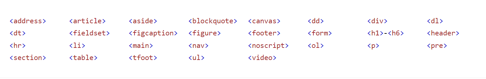
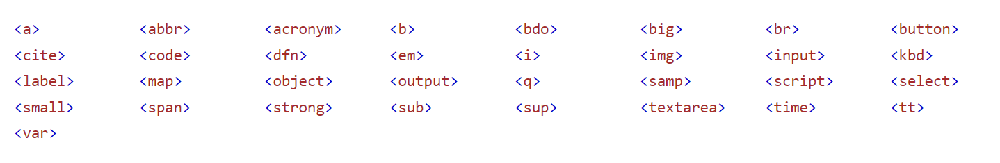

# Basics of HTML, CSS, and JS

## **HTML & CSS Reading**

A lot of this reading was review of HTML and CSS concepts and language, of which I will make note of what is new to this site.

## Structural vs. Semantic Markups

* Structural elements within which other elements live inside of, and that dictate the structure of the page

* Semantic elements don't affect the structure of the page, rather the content within it

## Block elements vs. Inline elements

* Block elements are elements that when selected in CSS take up an entire bar of the webpage

* Inline elements only affect a small portion of that bar when selected in CSS

Here are the blcok level elements in HTML

And here are the inline elements in HTML

## Rules of Specificity

* **Last Rule**

  * If two selectors are identical, the latter of the two will take precedent and become affected by the style modifier
  
* **Specificty**
  * If one selector is more specific than the other, the more specific will take precendence

* **Important**
  * You can add !important after any property value to indicate that it should be considered more important than other rules that apply to the same statement

* **Inheritance**
  * If you select an element that has child elements contained within it, those child elements will also be affected

## **JavaScript Reading**

A lot of this reading was also review, so I will just put down what was either new material for me, or material that I was better understood by myself after having already interacted with the concept.

## Value Types

* Numeric
  * Numeric points of data are numbers

* String
  * String values are letters or other characters conatined within quotes

* Boolean
  * True or false values

## Rules for Naming Variables

* Names must start with either a letter, a $, or a _

* Names of variables can contain any and all of the characters above, but may not include - nor .

* Names may not contain keywords or reserved words

* Keep in mind that the name is case sensitive

* Use a name that realates to the what the variable is doing

* For every word after the first word, instead of a space, simply capitalize the next word

## Things I want to know more about

I feel like I loosely grasp the concept of arrays, but would like to unuderstand them more. I feel like they are a super useful tool and could cut out a lot of repetitive coding