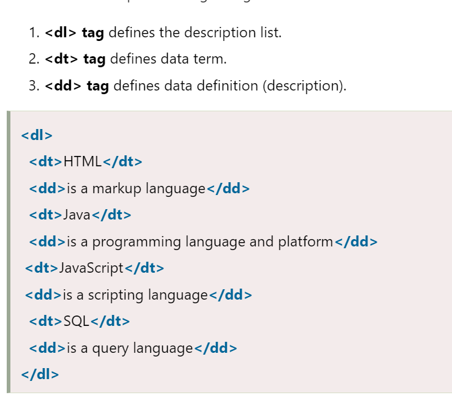
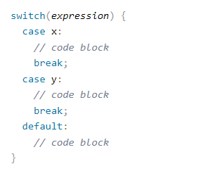

# HTML Lists, Control Flow with JS, and the CSS Box Model

## CSS Reading

### Lists

A variety of lists can be interjected into the HTML structure. In addition to the previously mentioned ```<ul>``` and ```<ol>``` one can also create definition lists.



### Boxes

Boxes, as CSS understands them, are just big enough to hold the content within them. This size is determined by % of page, pixels, or ems.

**Border, Margin, and Padding**

* Border: Separates the edges of boxes from one another

* Margin: Sits outside the border. Can create a gap between the borders of two boxes

* Padding: The space between the border of a box and any content contained within

**Helpful CSS Properties**

* width and height
  * Can set either to -min or -max to control either property and manipulate the value from there

* Overflow: tells the code what to do with content that doesn't fit into it's box
  * Hidden: hides the content that doesn't fit
  * Scroll: adds a scroll bar to the box

* Border-width:
  * Control the width of a banner with either a pixel value or thin, medium or thick value. Can also control any individual side with the border-top, right, bottom, or left side
    * This order is CSS wide and the sides can be listed as such if they are separated by commas

* Border-style:
  * Change the look of your border

* Inline vs. Block display
  * display: inline
    * Will change a selector that normally behaves as a block element to where it behaves as an inline element
  * display: block
    * Will change a selector that normally behaves as an inline element to where it behaves as a block element
  * display: inline-block
    * Causes a block element to flow like an inline, while retaining everything else about the element
  display: none
    * Hides the element from the page as well as the space where it would have gone. It can still be found if the page is inspected though

## JavaScript Reading

A lot of the reading in the Java Script reading can be found in the Java section of 102, but there was one section that was new to me. See below.

### Switch Statements

Switch statements: Start with a variable called a a switch value. from there you fill out the switch code, shown below, where the input value triggers one 'case'. When that case is executed, it fires an output, and when it hits 'break;', it stops.



We can see here the based on if it is x or y fired, there will be a specific outcome coded out for an output. The default here is essentially functioning as an else in this case.