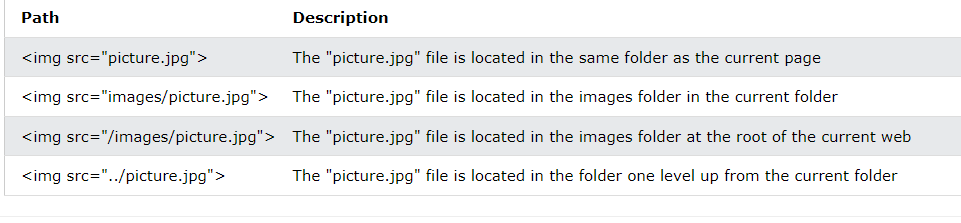

# HTML Links, JS Functions, and Intro to CSS Layout

These topics actually address some of the exact CSS problems I was having on today's lab, and I think will help clear a lot of things up for my CSS understanding in the future

## Links

File paths

Linking to things within your text editor requires knowledge about file path, which dictates what you put into the src attribute.

**Email Links**

Within the href link, you can add mailto: to link an email if it is one

## Layout

If a one block level element sits inside another one, the outer one is known as the containing or parent element

**Normal Flow**

Every block level element appears on a new line, causing each item to appear lower down the page than the precious one. **Even if there is space for two block level elements to sit side by side, they will not appear next to each other**. 

**Relative Positioning**

Moves an element from where it would have been originally placed. It can go up, down, left, right. **This does not affect the position of surrounding elements. They stay as they would be in normal flow**

**Absolute Positioning**

This positiions the element relative to its containing element. It is taken out of normal flow, so it doesn't affect the surrounding elements and they ignore the blank space it would have taken up. Absolutely positioned elements move as users scroll downt the page

**Fixed Positioning**

Same as absolute, but instead of being positioned relative to the containing element, it is positioned relative to the browser window

**Floating Elements**

Allows you to take an element out of the normal flow and position it to the far left or right of the containing box. It then becomes a block level element around which other content can flow

**Pair Programming**

Pair programming is one of the wildest concepts that I have ever heard, but the more I think about it the more it makes a ton of sense. One person is writing the code, while the other using words to steer the writer and also use their own computer to help troubleshoot. This concept gives me all sorts of anxiety, but at the same time it feels like a hige opportunity to learn and become a better coder and communicator

**Things I want to know more about**

* I'm still a little shaky on the difference between fixed and absolute positioning
