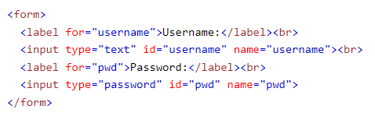

# Forms and JS Events

## Forms

Forms refer to a space in a printed document that contains spaces for you to fill in information.

Examples of Forms:

* Text Inputs
  * Used for taking a single ,ine of text from the user

* Password Input
  * A text input box that masks the characters typed

* Text Area
  * A multi-line text input field

* Radio Buttons
  * Used when the user can choose to pick just one of multiple buttons

* Checkboxes
  * Radio buttons, but the use can select multiple options

* Drop-down boxes
  * Used when the user must pick one of a number of options from a list.

* Submit Button
  * Used to submit dats from the form to another webpage

* Image Button
  * Submit buttons but you can submit an image file

* File Upload
  * Allows users to upload files to a website

**How Forms Work** 

Forms exist by creating name/value pairs, the name of which is tied to the prompt given to the user, the value of which is inputted byt the user.

**In Practice**

To Inject a form into your webpage, use the ```<form>``` tag, and link it to the webpage that the user will see it to the webpage where you have built it with the ```<action>``` tag.

The ```<input>``` tag is then used to delineate what kind of value will be received by the form with the ```<input>``` tag. From there different attributes are given to indicate what kind of name/value pair will be gleaned from the form.

Ex:



## Lists, Tables, And Forms

You can change the indicator of the list bullet in CSS by targeting the ol in CSS and change the ```<list-style-type>``` property to different values. 

Ex:


You can also link and image to be the indicator.

**Gaps Between Cells**

You can manipulate the space between cells of a table with the collapse and separate property in CSS. These get rid of the space between cells on a table and create a specified border between cells, respectively.

## Events

An event is something that is triggered by your JavaScript code, and it in some way changes the page that the user sees based on their input. Here is a link to a cheatsheet of some useful events. [cheatsheet](https://www.javatpoint.com/javascript-events)

**Triggereing an Event with JavaScript Code**

1. Select the element node that you want the script to respond to
2. Indicate the event that you want triggered by the selected node
3. State the code that you want run when the node is triggered

Example:

```element.onevent = functionName;```

Step one is done by element part of the code, onevent is the indication of what is triggered, and funtionName is the code that will run when triggered

## Things I want to know more about

* I don't understand Event Listeners, but they seem extremely useful, and it seems to pair with Event Flow.
