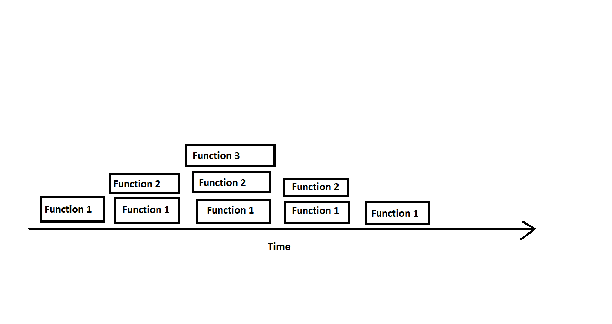

# In Memory Storage

## Understanding the JavaScript Call Stack

1. **What is a ‘call’?** A function invocation.

2. **How many ‘calls’ can happen at once?** One.

3. **What does LIFO mean?** Last in, first out.

4. **Draw an example of a call stack and the functions that would need to be invoked to generate that call stack.**  Seen here, the function one requires function two as a callback function, and function 2 requires function 3 as a function. Since only one function can execute at a time, the functions stack until all are set to fire that are needed for function 1 to execute, at which point three executes. When 3 executes that allows 2 to execute, which in turn allows 1 to execute, completing the stack.

5. **What causes a Stack Overflow?** When a fired function is recursive and has no exit point.

## JavaScript Error Messages

1. **What is a ‘reference error’?** A reference error occurs when your code uses a variable that is not yet defined.

2. **What is a ‘syntax error’?** A syntax error occurs when the code is unable to be parsed due to the sytax.

3. **What is a ‘range error’?** A range error occurs when you try to manipulate the length of an object and the value you assign to that length is invalid.

4. **What is a ‘type' error’?** A type error occurs when the type of data that you are trying to access, and the type of data that actually exists at the point that you are referencing are incompatible.

5. **What is a breakpoint?** It is a palce where the code is instentionally stopped for debugging purposes.

6. **What does the word ‘debugger’ do in your code?** It will create a breakpoint in your code so you can examine what is happening at that specific point.