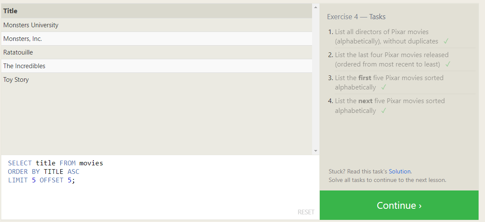

# Introduction to SQL

## What is SQL

SQL stands for Structured Query Language, and is how you make queries to databases. There are many different kinds of queries one can make to databases, which will be shown below.

## How to use SQL

**Selection of data**

One of the easiest ways to interact with a database using SQL is to simply pull specific data that fits within parameters you set. For the most part these all use the standard logical operators as well as comparative operators to narrow down your search.

Here are the screenshots for the first section of the SQL practice, which focuses on the selection of data from one or multiple tables:

Exercise 1: 
Exercise 2: 
Exercise 3: 
Exercise 4: 
Exercise 5: 
Exercise 6: 

**Manipulation of Data**

The rest of the exercises focus on pulling data from multiple databases, editing data in databases, deleting data, and even creating/ deleting new databases.

Here are the screenshots for those exercises:

Exercise 13: 
Exercise 14: 
Exercise 15: 
Exercise 16: 
Exercise 17: 
Exercise 18: 